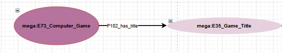

<!--
author: Canan Hastik (0000-0003-1729-4642)

author: Gudrun Schwenk ()

email: c.hastik@igsd-ev.de

email: g.schwenk@igsd-ev.de

version:  v1

language: DE

icon: https://raw.githubusercontent.com/soda-collections-objects-data-literacy/liascript-oers/refs/heads/main/resources/SODa-Logo_full.svg
link: https://raw.githubusercontent.com/soda-collections-objects-data-literacy/SODa_WissKI-ISWC25Bits/refs/heads/main/soda.css

license: CC BY 4.0

comment: Dieser Text erscheint als Info innerhalb der Liascript-Module oben rechts hinter dem (i) und sollte den Inhalt des Moduls kurz beschreiben. Vorschlag: Mirco-Content zum Lernziel "Lernende können FAIR-Prinzipien erläutern". Dieses Modul ist Teil eines Einführungskurses zum Forschungsdatenmanagement, der von “OER.Net UAG FDM-Basiskurs” auf Grundlage der Lernzielmatrix zum FDM entwickelt wurde. Der Basiskurs entwickelt das Konzept der EduBricks weiter und ist als “Arbeitsgruppe 3: Einbettung und Vernetzung des modularen und skalierbaren Konzeptes” zudem Teil der NFDI-Sektion Education and Training.

title: Template für die Erarbeitung eines Micro-Contents anhand eines Lernziels für generischen FDM-Basiskurs

description: Dieses Template wurde als Vorlage für die Entwicklung von Microlearning-Content zum Themenbereich Forschungsdatenmanagement (FDM) in Orientierung an Lernzielen der [Lernzielmatrix zum Forschungsdatenmanagement (FDM)](https://zenodo.org/records/15025246) entwickelt.

keywords: FDM, Forschungsdatenmanagement, Forschungsdaten, Lernziel, Micro-Content

community: Wissenschaftliche Kommunikationsinfrastruktur (WissKI) und Sammlungen, Objekte, Datenkompetenzen (SODa)

PublicationDate: noch unveröffentlicht

LearningResourceType: SODa How-to-Tutorial

-->

# SODa WissKI Bits: Ontologiegestützte Modellierung von Forschungsdaten

**DATENMODELL ENTWICKELN UND IMPLEMENTIEREN AM BEISPIEL** 

Modul 1: **Von der Sammlung zum Diagramm – verstehen und erklären**

Einheit 2: **Analyse-Workflow: Von der Forschungsfrage zur Graphenstruktur**  

**Dauer:** ~ 15 Min.

Lernziel: 

* Begriff Ontologie erläutern. (LZ-ID 03_007_0775)
* Aspekte von Ontologien benennen. (LZ-ID 03_007_0776)
* Methoden zur Entwicklung von Ontologien benennen. (LZ-ID 03_007_0784)
* einen Workflow für die semantische Modellierung als Datendokumentation benennen und anwenden. (LZ-ID SODa_03_001_0626 und SODa_03_001_0627) 

---

## Von der Datenanalyse zur semantischen Modellierung (nochmal überarbeiten)

* In den Geisteswissenschaften, GLAM-Institutionen und Forschungssammlungen wird mit **komplexen Objekt- und Kontextdaten**, die historische, kulturelle und relationale Bedeutungen tragen (z. B. Provenienz, Beziehungen, Interpretationen) gearbeitet.
* Tabellen können Daten beschreiben und erfassen in erster Linie Eigenschaften (Attribute) – aber mit Tabellen lässt sich kein Wissen modellieren. Beziehungen, Bedeutungen und Kontexte bleiben dabei unsichtbar.
* Genau hier wird **semantische Datenmodellierung** relevant: Sie ermöglicht es, Wissen **strukturiert und interoperabel** darzustellen.
* Semantisches Modellieren ist **nicht nur technisch**, sondern vor allem ein **konzeptioneller Prozess**, der **Fachwissen und methodisches Denken** erfordert.
* **WissKI** unterstützt diesen Prozess, indem es **Ontologien, Modellierung und Dateneingabe** über den **Pathbuilder** miteinander verbindet.

---

## Begriff „Ontologie“ (Kurzdefinition)

Eine Ontologie ist eine formal beschriebene Wissensstruktur, die festlegt,

* welche Arten von Dingen es in einer Domäne gibt (z. B. Objekt, Person, Ereignis, Ort, Zeit),
* wie diese Dinge miteinander verbunden sind,
* und welche Aussagen darüber sinnvoll und konsistent modelliert werden können.

Ontologien helfen damit, fachliches Wissen so zu dokumentieren, dass es maschinenlesbar, vergleichbar und nachnutzbar wird. Im Kontext der Semantic-Web-Technologien lässt sich eine Ontologie praktisch als Struktur verstehen, die u. a. Klassen, Eigenschaften (Properties) und Individuen bereitstellt und damit Aussagen über Ressourcen formal abbilden kann. [1]

Ontologien unterstützen damit die systematische und konsistente Repräsentation von Domänenwissen, sodass Informationen maschinenlesbar und für die Nachnutzung in unterschiedlichen Systemen anschlussfähig werden. [2]

Die bekannteste Definition beschreibt eine Ontologie als "eine explizite, formale Spezifikation einer Konzeptualisierung", d. h. sie beschreibt strukturierend, welche Konzepte/Entitäten in einem bestimmten Gegenstandsbereich relevant sind und welche Beziehungen zwischen ihnen bestehen. [3]

---

## Aspekte von Ontologien (Bausteine)

Ontologien bestehen typischerweise aus:

* **Klassen** (z. B. Spiel, Person, Organisation, Ereignis)
* **Relationen / Properties** (z. B. „hat Titel“, „wurde veröffentlicht von“)
* **Instanzen** (konkrete Dinge, z. B. *A Link to the Past*)
* **Constraints / Modellannahmen** (z. B. welche Beziehungen zulässig sind)
* **Definitionen / Scope Notes** zur semantischen Präzisierung (z. B. in Referenzmodellen wie CIDOC CRM)

---

## Methoden zur Entwicklung von Ontologien

Die Entwicklung einer Ontologie folgt typischerweise einem methodischen, mehrstufigen und iterativen Vorgehen. Dazu zählen u. a. die Erhebung zentraler Begriffe und Definitionen („ontology capture“), die Strukturierung dieser Konzepte in Klassen und Relationen sowie die kontinuierliche Prüfung und Überarbeitung des Modells im Hinblick auf Konsistenz und Nutzbarkeit. [4]

Praktische Ontologieentwicklung wird dabei häufig als ein Prozess verstanden, der sowohl Domänenwissen als auch Anwendungsanforderungen integriert und schrittweise in eine formal nutzbare Wissensstruktur überführt.

In der Praxis entstehen Ontologien häufig durch eine Kombination aus:

* **Top-down-Modellierung:** Start mit einem Referenzmodell (z. B. CIDOC CRM) und domänenspezifische Spezialisierung
* **Bottom-up-Modellierung:** Start aus vorhandenen Daten und schrittweise Ableitung von Klassen und Beziehungen
* **Competency Questions:** Modellierung aus typischen Analyse- und Forschungsfragen heraus (z. B. „Welche Spiele haben Merkmal X?“)
* **Iteratives Prototyping:** Modell entwerfen → prüfen → anpassen (Konsistenz, Erweiterbarkeit, Abfragbarkeit)

---

**Zielsetzung dieses Moduls ist es:**  

* Domänenwissen schrittweise in ein ontologiebasiertes Datenmodell zu übersetzen,
* Modellierungsentscheidungen nachvollziehbar zu dokumentieren,
* und die Grundlage für ein **konsistentes CIDOC-CRM-basiertes Diagramm** zu schaffen, das später in WissKI umgesetzt wird.

---

## Workflow-Übersicht (Methode)

Dieser Workflow von Modul 1 und Modul 2 umfasst: 

1. **Objektdaten analysieren** – Datenentitäten und Beziehungen verstehen  
2. **Bedeutungen erfassen** – Konzepte und Eigenschaften identifizieren  
3. **Semantik modellieren** – Bedeutungen auf die Ontologie (CIDOC CRM) abbilden  
4. **Datenpfade erstellen** – WissKI-Pfade modellieren & Pathbuilder konfigurieren  
5. **Evaluieren & diskutieren** – Workflows reflektieren und Erfahrungen austauschen  

was ist besser (???)

Der Workflow dieses Tutorials führt von der Forschungsfrage zur Graphenstruktur:

1. **Objektdaten & Quellen analysieren** – Welche Informationen liegen vor?
2. **Kernentitäten und Kontexte identifizieren** – Welche Dinge (Objekt/Person/Ort/Zeit/Organisation) sind relevant?
3. **Ereignisse und Beziehungen formulieren (Graphlogik)** – Was passiert, wer ist beteiligt, wie hängt es zusammen?
4. **Abgleich mit Ontologie (z. B. CIDOC CRM)** – Begriffe semantisch präzisieren und konsistent zuordnen
5. **Vorbereitung der Umsetzung** – Grundlage für Diagramm und spätere Pfadstruktur (Modul 2)
   
---

## Beispielobjekt

Popkulturelle Objekte wie Games eignen sich didaktisch besonders gut, weil sie meist klare Basisinformationen (z. B. Titel, Veröffentlichung, Plattform) besitzen und gleichzeitig reichhaltige Kontexte ermöglichen (z. B. Beteiligte, Versionen, Serienzugehörigkeit). Dadurch lässt sich gut zeigen, wie aus scheinbar „einfachen“ Daten eine präzise Graphstruktur entsteht.

**Super Nintendo Entertainment System (SNES) Spiel: *The Legend of Zelda***

| Darstellung | Beschreibung |
|------------|--------------|
| **Objekt** |  |
| **Semantische Annahme** | Titel des Objekts: *The Legend of Zelda: A Link to the Past* |
| **Draw.io Modell** |  |
| **WissKI Pathbuilder** |  |

Zelda ist super, aber setze 1–2 Sätze, warum ein popkulturelles Objekt didaktisch gut ist (klare Production, Publisher, Plattform etc.).

____________________________

[1] World Wide Web Consortium. (2012, December 11). OWL 2 Web Ontology Language Primer (Second Edition). W3C Recommendation. https://www.w3.org/TR/owl2-primer 
[2] Noy, N. F., & McGuinness, D. L. (2001). Ontology Development 101: A Guide to Creating Your First Ontology. Stanford Knowledge Systems Laboratory.
[3] Gruber, T. R. (1993). A Translation Approach to Portable Ontology Specifications. Knowledge Acquisition, 5(2), 199–220.
[4] Uschold, M., & King, M. (1995). Towards a Methodology for Building Ontologies.

