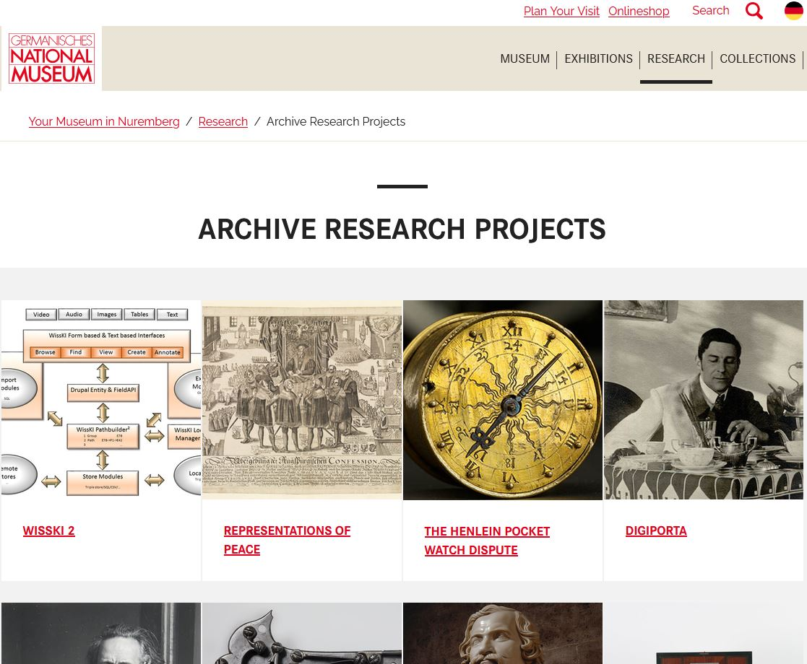
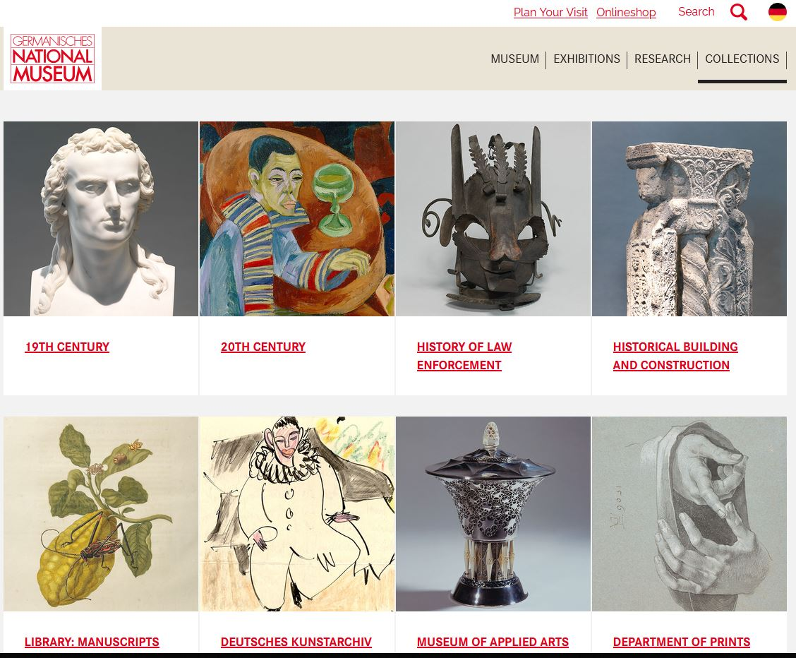
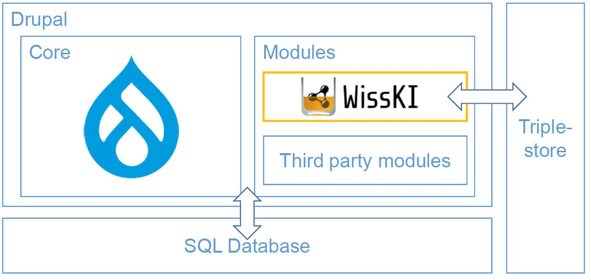

<!--
author: Canan Hastik (0000-0003-1729-4642)

author: Gudrun Schwenk ()

email: c.hastik@igsd-ev.de

email: g.schwenk@igsd-ev.de

version:  v1

language: DE

icon: https://raw.githubusercontent.com/soda-collections-objects-data-literacy/liascript-oers/refs/heads/main/resources/SODa-Logo_full.svg
link: https://raw.githubusercontent.com/soda-collections-objects-data-literacy/SODa_WissKI-ISWC25Bits/refs/heads/main/soda.css

license: CC BY 4.0

comment: Dieser Text erscheint als Info innerhalb der Liascript-Module oben rechts hinter dem (i) und sollte den Inhalt des Moduls kurz beschreiben. Vorschlag: Mirco-Content zum Lernziel "Lernende können FAIR-Prinzipien erläutern". Dieses Modul ist Teil eines Einführungskurses zum Forschungsdatenmanagement, der von “OER.Net UAG FDM-Basiskurs” auf Grundlage der Lernzielmatrix zum FDM entwickelt wurde. Der Basiskurs entwickelt das Konzept der EduBricks weiter und ist als “Arbeitsgruppe 3: Einbettung und Vernetzung des modularen und skalierbaren Konzeptes” zudem Teil der NFDI-Sektion Education and Training.

title: Template für die Erarbeitung eines Micro-Contents anhand eines Lernziels für generischen FDM-Basiskurs

description: Dieses Template wurde als Vorlage für die Entwicklung von Microlearning-Content zum Themenbereich Forschungsdatenmanagement (FDM) in Orientierung an Lernzielen der [Lernzielmatrix zum Forschungsdatenmanagement (FDM)](https://zenodo.org/records/15025246) entwickelt.

keywords: FDM, Forschungsdatenmanagement, Forschungsdaten, Lernziel, Micro-Content

community: Wissenschaftliche Kommunikationsinfrastruktur (WissKI) und Sammlungen, Objekte, Datenkompetenzen (SODa)

PublicationDate: noch unveröffentlicht

LearningResourceType: SODa How-to-Tutorial

-->

# SODa WissKI Bits: Ontologiegestützte Modellierung von Forschungsdaten

**DATENMODELL ENTWICKELN UND IMPLEMENTIEREN AM BEISPIEL** 

Modul 1: **Von der Sammlung zum Diagramm – verstehen und erklären**

Einheit 3: **WissKI Kurzeinführung**  

**Dauer:** ~ 15 Min.

Lernziele 

* die fünf Stufen des 5-Sterne-Modells für offene Daten benennen. (LZ-ID 01\_008\_0158)
* FAIR Prinzipien benennen. (LZ-ID 01\_007\_0117)
* geeignete Technologien zur Unterstützung der Anwendung der FAIR-Prinzipien benennen. (LZ-ID 01\_007\_0121)
* die spezifischen Funktionen und Anwendungsbereiche der Wissenschaftlichen Kommunikationsinfrastruktur WissKI benennen und erläutern. (LZ-ID SODa\_01\_010\_0191a und SODa\_01\_010\_0192a)
* WissKI Pathbuilder als Werkzeug zur Definition einer domänenspezifische Ontologiestruktur bennenen und erläutern. (LZ-ID SODa\_03\_007\_0803 und LZ-ID SODa\_03\_007\_0804)
* die Methode der ereigniszentrierten Modellierung mit dem Referenzmodell CIDOC CRM erläutern. (LZ-ID SODa\_03\_007\_0785a)
* Leistungsfähigkeit und Effizienz von IT-Infrastrukturen für das sammlungsbezogene Forschungsdatenmanagement (FDM) mit der Wissenschaftlichen Kommunikationsinfrastuktur WissKI benennen. (LZ-ID SODa\_01\_010\_0202)

---

## WissKI in Kürze

**WissKI** (Wissenschaftliche Kommunikationsinfrastruktur) ist:

* eine freie, quelloffene virtuelle Forschungsumgebung
* entwickelt für Kulturerbe- und Forschungsdaten
* basierend auf Semantic-Web-Technologien
* modular aufgebaut und standardorientiert.

WissKI wird u. a. am **Germanischen Nationalmuseum (GNM)** in Nürnberg eingesetzt —

* dem größten kulturhistorischen Museum im deutschsprachigen Raum
* das Maßstäbe für digitale Forschungsinfrastrukturen setzt.

WissKI ist **nicht nur** eine Sammlungsdatenbank –  es ist ein **semantisches Datenmanagementsystem für Linked Open Data (LOD)**  und unterstützt die FAIR-Prinzipien (
**Findable – Accessible – Interoperable – Reusable**)

---

## WissKI und Drupal 

WissKI ist **keine eigenständige Software** sondern ein Set an Modulen, die das Content-Management-System **Drupal** semantisch erweitert.

---

### Drupal stellt bereit …

- Benutzer- und Rollenverwaltung  
- Modulare Systemarchitektur (Framework)  
- Schnittstellen für Datenaustausch (REST/JSON)  
- Zugriffskontrolle und Rechtemanagement  
- Mehrsprachige Benutzeroberfläche  

---

### WissKI ergänzt …

- Ontologiebasierte Modellierung und semantische Datenstrukturierung  
- Pathbuilder, ein Werkzeug zur Definition semantischer Pfade  
- RDF-Triple-Store zur Speicherung der Daten  
- SPARQL-Endpunkt für Abfragen und Zugriff  
- Publikation als Linked Open Data (LOD)  

---

## Der WissKI Pathbuilder

Der **Pathbuilder** ist das **Herzstück von WissKI**.

Der Pathbuilder definiert:

* **Gruppen** → semantische Entitäten, z. B. Objekt, Person, Ort, Ereignis  
* **Pfade** → Beziehungen diese Entitäten, z. B. Objekt → wurde geschaffen von → Person  
* **Widgets** → automatisch generierte Eingabeformulare, deren Struktur aus der Semantik abgeleitet wird

So ist es möglich in WissKI **nicht mit Tabellen**, sondern mit **ontologiebasierten Strukturen** zu arbeiten. 

Gleichzeitig bleibt WissKI flexibel, ermöglicht semantische Konsistenz und ist in der Datenpflege bestmöglich Nutzendenunterstützend.

---

## Semantisches Modellieren auf *WissKI-Art* = das Prinzip der ereigniszentrierten Modellierung (CIDOC CRM) erklären

In WissKI werden  **nicht nur Daten** gespeichert und erfasst, sondern **Bedeutung** modelliert.

Leitfrage:

> **Welche reale Beziehung besteht zwischen den Dingen?**

Beispiel aus dem Video:

* **Albrecht Dürer** → Person  
* wurde geboren in → **Nürnberg** (Ort)  
* zu → **einem bestimmten Zeitpunkt**  
* hatte eine Mutter → **Barbara Dürer** (Person)  
* schuf → **Selbstbildnis** (Objekt)
* **Entstehungszeitpunkt** in einer **Quelle** erwähnt
* während → **seiner künstlerischen Schaffensperiode**  
* in → **Nürnberg**

Diese semantischen Bedeutungsaussagen lassen **einen Wissensgraphen** entstehen, ein Netzwerk verbundenen Informationen.

(Video: `../assets/semanticModelling.mp4`)

---

## Vorteile von WissKI (Relevanz)

* ermöglicht **wissensbasierte Modellierung** statt starrer Tabellenschemata
* stellt **Interoperabilität** durch etablierte Ontologien wie **CIDOC CRM** sicher
* unterstützt die **FAIR-Prinzipien**
* generiert **Eingabeformulare automatisch** auf Basis semantischer Pfade
* publiziert Daten als **Linked Open Data**
* bietet **leistungsfähige SPARQL-Abfragen**
* verbindet **konzeptionelle Klarheit** mit **technischer Umsetzung**.

---

## Die Semantik zentral in WissKI (Nutzen)

*Übersetzung prüfen*

* **CIDOC CRM** definiert Konzepte & Beziehungen  
* **Semantische Pfade** bilden die Datenstruktur 
* **Formulare** erzwingen konsistente Dateneingabe  
* **RDF-Wissensgraph** ermöglicht Austausch & LOD-Publikation

