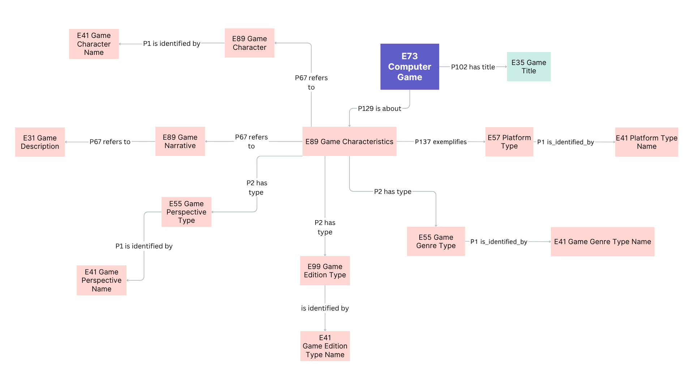

<!--
author: Canan Hastik (0000-0003-1729-4642)

author: Gudrun Schwenk ()

email: c.hastik@igsd-ev.de

email: g.schwenk@igsd-ev.de

version:  v1

language: DE

icon: https://raw.githubusercontent.com/soda-collections-objects-data-literacy/liascript-oers/refs/heads/main/resources/SODa-Logo_full.svg
link: https://raw.githubusercontent.com/soda-collections-objects-data-literacy/SODa_WissKI-ISWC25Bits/refs/heads/main/soda.css

license: CC BY 4.0

comment: Dieser Text erscheint als Info innerhalb der Liascript-Module oben rechts hinter dem (i) und sollte den Inhalt des Moduls kurz beschreiben. Vorschlag: Mirco-Content zum Lernziel "Lernende können FAIR-Prinzipien erläutern". Dieses Modul ist Teil eines Einführungskurses zum Forschungsdatenmanagement, der von “OER.Net UAG FDM-Basiskurs” auf Grundlage der Lernzielmatrix zum FDM entwickelt wurde. Der Basiskurs entwickelt das Konzept der EduBricks weiter und ist als “Arbeitsgruppe 3: Einbettung und Vernetzung des modularen und skalierbaren Konzeptes” zudem Teil der NFDI-Sektion Education and Training.

title: Template für die Erarbeitung eines Micro-Contents anhand eines Lernziels für generischen FDM-Basiskurs

description: Dieses Template wurde als Vorlage für die Entwicklung von Microlearning-Content zum Themenbereich Forschungsdatenmanagement (FDM) in Orientierung an Lernzielen der [Lernzielmatrix zum Forschungsdatenmanagement (FDM)](https://zenodo.org/records/15025246) entwickelt.

keywords: FDM, Forschungsdatenmanagement, Forschungsdaten, Lernziel, Micro-Content

community: Wissenschaftliche Kommunikationsinfrastruktur (WissKI) und Sammlungen, Objekte, Datenkompetenzen (SODa)

PublicationDate: noch unveröffentlicht

LearningResourceType: SODa How-to-Tutorial

-->

# SODa WissKI Bits: Ontologiegestützte Modellierung von Forschungsdaten

**DATENMODELL ENTWICKELN UND IMPLEMENTIEREN AM BEISPIEL** 

Modul 1: **Von der Sammlung zum Diagramm – verstehen und erklären**

Einheit 5: **Domänenanalyse: Kernentitäten, Ereignisse, Kontext - vom Objekt zur Hypothese**  

**Dauer:** ~ 30 Min.

Lernziele

* Kernentitäten (Objekt/Person/Ort/Zeit/Ereignis) einer Objektsammlung benenen und erläutern. (LZ-ID SODa\_03\_007\_0806 und LZ-ID SODa\_03\_007\_0807)
* Datentyp-Eigenschaften des Referenzmodells CIDOC CRM benennen. (SODa\_03\_007\_0808) *überarbeiten*

---

## Ziel und Szenario 

Dies ist eine Praxiseinheit. In dieser Einheit wird ein Beispielobjekt aus der Domäne **Computerspiele** analysiert.

Am Ende können Lernende...

* zentrale **Kernentitäten** der Beispiel-Domäne (Computerspiele) benennen (Objekt/Person/Ort/Zeit/Ereignis),
* diese Entitäten über **bedeutsame Beziehungen** sinnvoll verbinden,
* und eine erste Zuordnungen der Entitäten zu **CIDOC CRM Klassen** benennen,
* ein erstes **konzeptionelles Datenmodell (Mindmap)** vorbereiten, das später in **Protégé** formalisiert und in **WissKI** importiert wird.

---

## Ausgangspunkt: Beispielobjekt „Zelda“

Ausgehend von unserem Beispiel **„Zelda“** identifizieren wir Konzepte, die Computerspiele (und ihre Kontexte) beschreiben.

**Ziel ist nicht**, ein vollständiges Spielemodell zu erstellen, sondern ein **minimal konsistentes Kernmodell** als Entwurf:

* verständlich für Menschen,
* anschlussfähig für semantische Modellierung (CIDOC CRM),
* erweiterbar für spätere Umsetzung (Protégé/WissKI).

---

## Warum eignet sich die Domäne „Computerspiele“?

Die Domäne ist didaktisch besonders geeignet, weil sie...

* sowohl **physische** als auch **digitale** Objekte umfasst,
* gut nachvollziehbare **Produktions- und Veröffentlichungskontexte** besitzt,
* typische **Ereignisse** enthält (z. B. Release, Portierung, Neuauflage),
* **Versionen/Editionen** und **Serienzugehörigkeiten** abbildbar macht,
* klare Identifikatoren und Benennungen verwendet (Titelvarianten, Produktcodes).

---

## Fokus dieser Modellierungsübung

Wir konzentrieren uns auf drei Bereiche:

* **Spieltitel** (als Benennung / Appellation)
* **Spielmerkmale** (characteristics / types)
* **narrative Elemente** (z.B. Beschreibung, Perspektive, Figuren)

### Beispiele für Spielmerkmale

* Plattform (z.B. Nintendo 64, PlayStation, PC)
* Genre (z.B. Action-Adventure, RPG)
* Edition oder Version (z.B. Collector’s Edition, Remastered)

### Beispiele für narrative Elemente

* Perspektive (z.B. First-Person, Third-Person)
* Spielbeschreibung
* Charaktere / Figuren (z.B. Zelda)

---

## Übung – Modellskizze 

**Arbeitsform:** Breakout-Räume / Einzelarbeit oder Teams (2–4 Personen)  
**Material:** Papier & Stift (oder digitales Whiteboard)  
**Zeit:** **7 Minuten**

**Aufgabe: Eine Mini-Mindmap als Modellskizze entwerfen**

Eine einfache Struktur skizzieren, die folgende Punkte erfüllt:

1. **5 Kernentitäten** (Objekt/Person/Ort/Zeit/Ereignis – nicht alle müssen vorkommen)
2. **Diese Kernentitäten mit Beziehungen verbinden** („hat“, „wurde hergestellt durch“, „wurde veröffentlicht von“ …)

Tipp: **Weniger ist mehr!**

**Leitfragen können sein...**

| Schritt | Leitfrage | Ergebnis |
|-------|-----------|----------|
| 1 | Welche Kernentitäten gibt es? | Liste/Nodes im Modell |
| 2 | Welche Ereignisse erklären den Kontext? | 1–2 Ereignisknoten |
| 3 | Wie hängen die Dinge zusammen? | gerichtete Beziehungen |

## Orientierung mit CIDOC CRM 

---

### Mini-Demo: CIDOC CRM in Kürze 

**Aufgabe: CIDOC CRM sichten**

CIDOC CRM sichten und für zwei Kernentitäten jeweils mindestens eine passende Klasse heraussuchen.

1. **2 Begriffe aus eurer Skizze** (z.B. Spiel, Publisher, Release)
2. mögliche **CIDOC CRM-Klasse** grob zuordnen.

Für den Einstieg eignen sich zentrale CIDOC CRM Klassen als „Baukasten“:

| CIDOC CRM Klasse | Bedeutung im Beispiel |
|------------------|-----------------------|
| **E28 Conceptual Object** | Spiel als Konzept / Inhalt |
| **E22 Human-Made Object** | physische Kopie (Cartridge, Disc, Box …) |
| **E21 Person** | Mitwirkende (z. B. Designer:in) |
| **E74 Group** | Studio / Publisher / Team |
| **E12 Production** | Herstellung / (ggf. Veröffentlichung als Ereignis) |
| **E42 Identifier** | Identifikatoren (Inventarnummern, Produktcodes …) |
| **E35 Title** | Titel als eigene Entität |
| **E55 Type** | kontrollierte Merkmale (z. B. Genre, Plattform) |

Quelle: [CIDCO CRM-Spezifikation (v7.1.3)](https://cidoc-crm.org/sites/default/files/cidoc_crm_version_7.1.3.pdf)  

---

## Ergebnis: Mindmap / Konzeptionelles Modell

Die Mindmap dient als Übergang zu den nächsten Schritten im Tutorial:

* das Modell wird als **Diagramm** klarer strukturiert,
* anschließend wird es in **Protégé** überprüft und formaler gefasst,
* und in Modul 2 als **Pfadstruktur im WissKI Pathbuilder** umgesetzt.
  
---

### Begründung der Modellierungsentscheidungen

| Pfad | Bedeutung | Warum so modelliert? |
|------|-----------|---------------------|
| **E73 → P102 has title → E35 Title** | Das Spiel hat einen Titel | Titel ist ein **eigenständiges Konzept**, nicht nur Text; ermöglicht Mehrsprachigkeit & Varianten |
| **E73 → P129 is about → E89 Propositional Object** | Das Spiel hat Eigenschaften | E89 erlaubt es, Merkmalsbündel strukturiert darzustellen und auf Quellen zurückzuführen |
| **E57 Type (Plattform) → P1 is identified by → E41 Appellation** | Plattform-Bezeichnung | Plattformen sind **kontrollierte Begriffe**, keine Freitexte |
| **E55 Type (Genre) → P1 is identified by → E41 Appellation** | Genre-Bezeichnung | Genre ist ein **Klassifikationsbegriff**; E55 unterstützt kontrollierte Vokabulare |
| **E99 Type (Edition) → P1 is identified by → E41 Appellation** | Edition / Version | Editionen sind **Domänenspezifika** → daher modelliert als Typen |

---

## Rolle von E41 Appellation und Datentyp-Eigenschaften in CIDOC CRM

CIDOC CRM ist primär auf **Beziehungen zwischen Entitäten** ausgelegt. Deshalb werden zentrale Informationen (z. B. Titel, Namen, Identifikatoren oder Rollen) häufig nicht nur als Text erfasst, sondern als eigene modellierbare Entitäten. So lassen sich Varianten, Mehrsprachigkeit, Quellenangaben und kontrollierte Vokabulare konsistent abbilden und eindeutig referenzieren.

Zentral hierfür ist **E41 Appellation**:

| Konzept                 | Erklärung                                                                                                                                                                                            |
| ----------------------- | ---------------------------------------------------------------------------------------------------------------------------------------------------------------------------------------------------- |
| **E41 Appellation**     | Namen, Benennungen und Bezeichnungen sind **eigenständige Entitäten**, nicht nur Textstrings. Das ermöglicht z. B. **Mehrsprachigkeit**, **Titelvarianten**, **stabile IDs** und **Quellenangaben**. |
| **P1 is identified by** | Verknüpft ein Konzept (z. B. ein Spiel, eine Person, eine Plattform) mit seiner **Benennung** und unterstützt damit **Klarheit und Interoperabilität**.                                              |

Gleichzeitig nutzt CIDOC CRM **Datentyp-Eigenschaften** (sog. literale wie Zahlen oder Zeichenketten) nur sparsam und vor allem dann, wenn der Wert nicht als eigenständige Entität modelliert werden muss.

**Typische Datentyp-Eigenschaften sind...**

* P190 has symbolic content (z.B. Zeichenkette / Textinhalt)
* P90 has value (z. B. numerischer Wert)

**Grundprinzip**

* CIDOC CRM bevorzugt semantische Identifikatoren und Beziehungen statt Freitextfeldern.
* Literale werden genutzt, wenn sie als reine Darstellung sinnvoll sind (z.B. ein Zahlenwert), während zentrale semantische Informationen (Titel, Rollen, Identifikatoren usw.) als Entitäten modelliert und idealerweise mit kontrollierten Vokabularen verknüpft werden.

**Hinweis:** Der gezielte Umgang mit Datentyp-Eigenschaften, kontrollierten Vokabularen und Interoperabilität wird in späteren Einheiten weiter vertieft.

