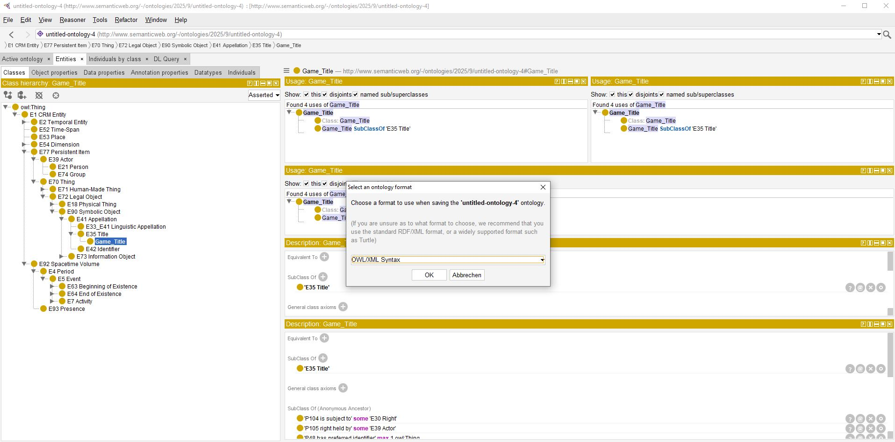

<!--
author: Canan Hastik (0000-0003-1729-4642)

author: Gudrun Schwenk ()

email: c.hastik@igsd-ev.de

email: g.schwenk@igsd-ev.de

version:  v1

language: DE

icon: https://raw.githubusercontent.com/soda-collections-objects-data-literacy/liascript-oers/refs/heads/main/resources/SODa-Logo_full.svg
link: https://raw.githubusercontent.com/soda-collections-objects-data-literacy/SODa_WissKI-ISWC25Bits/refs/heads/main/soda.css

license: CC BY 4.0

comment: Dieser Text erscheint als Info innerhalb der Liascript-Module oben rechts hinter dem (i) und sollte den Inhalt des Moduls kurz beschreiben. Vorschlag: Mirco-Content zum Lernziel "Lernende können FAIR-Prinzipien erläutern". Dieses Modul ist Teil eines Einführungskurses zum Forschungsdatenmanagement, der von “OER.Net UAG FDM-Basiskurs” auf Grundlage der Lernzielmatrix zum FDM entwickelt wurde. Der Basiskurs entwickelt das Konzept der EduBricks weiter und ist als “Arbeitsgruppe 3: Einbettung und Vernetzung des modularen und skalierbaren Konzeptes” zudem Teil der NFDI-Sektion Education and Training.

title: Template für die Erarbeitung eines Micro-Contents anhand eines Lernziels für generischen FDM-Basiskurs

description: Dieses Template wurde als Vorlage für die Entwicklung von Microlearning-Content zum Themenbereich Forschungsdatenmanagement (FDM) in Orientierung an Lernzielen der [Lernzielmatrix zum Forschungsdatenmanagement (FDM)](https://zenodo.org/records/15025246) entwickelt.

keywords: FDM, Forschungsdatenmanagement, Forschungsdaten, Lernziel, Micro-Content

community: Wissenschaftliche Kommunikationsinfrastruktur (WissKI) und Sammlungen, Objekte, Datenkompetenzen (SODa)

PublicationDate: noch unveröffentlicht

LearningResourceType: SODa How-to-Tutorial

-->

# SODa WissKI Bits: Ontologiegestützte Modellierung von Forschungsdaten

**DATENMODELL ENTWICKELN UND IMPLEMENTIEREN AM BEISPIEL** 

Modul 1: **Von der Sammlung zum Diagramm – verstehen und erklären**

Einheit 6: **Modellierung in Protégé: Konsistenzcheck und Erweiterungsstrategien**  

**Dauer:** ~ 10 Min.

Lernziel

* Software zur Erstellung von Ontologien benennen und anwenden. (LZ ID SODa\_03\_007\_0809 und SODa\_03\_007\_0810)
  
---

## Live-Demo in Protégé

Diese Einheit zeigt, wie auf Basis von **CIDOC CRM** eine **Domänenontologie** mit **Protégé** entwickelt wird.

**Protégé** ist ein frei verfügbarer Ontologie-Editor, der hier heruntergeladen werden kann: https://protege.stanford.edu

Mit einer klaren Vorgehensweise ist es möglich, auch ohne tiefgreifende Vorkenntnisse **eine Ontologie zu erstellen oder zu erweitern**.

---

## Schritte im Überblick

1. **Vorhandene Ontologie laden**  
   z.B. **Erlangen CRM**:  
   Eine OWL-Implementierung von CIDOC CRM  
   → Download: https://erlangen-crm.org/ontology/ecrm/ecrm_240307.owl

2. **Struktur erkunden**  
   * Klassen (konzeptuelle Entitäten)  
   * Objekteigenschaften (Relationen zwischen Entitäten)  
   * Datentyp-Eigenschaften (nur für Literale)

3. **Eigene Subklassen anlegen**  
   für neue Domänenkonzepte, z. B.:  
   * Game_Characteristic
   * Platform_Type
   * Genre_Type
   * Edition_Type

4. **Speichern & Exportieren**  
   Die erweiterte Ontologie wird gespeichert und steht anschließend für **WissKI** und den **Pathbuilder** bereit.

---

## Video-Demonstration

!?[autoplay video](../assets/Short_Protege_Intro.mp4)

@[video](../assets/Short_Protege_Intro.mp4)

https://raw.githubusercontent.com/soda-collections-objects-data-literacy/SODaHow-to-Tutorial/refs/heads/main/WissKIBits_Modul1/M1E6_Protege.md?token=GHSAT0AAAAAADTBPIEN2KKCZSPWVQD3XS3Y2LSS7MQ
https://raw.githubusercontent.com/user/repo/main/assets/Short_Protege_Intro.mp4

<table>
  <tr>
    <td></td>
  </tr>
</table>

