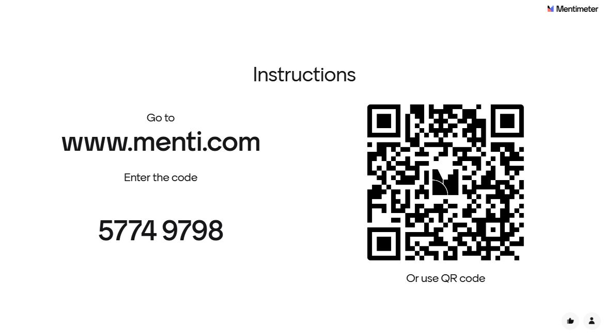

<!--
author: Canan Hastik (0000-0003-1729-4642)

author: Gudrun Schwenk ()

email: c.hastik@igsd-ev.de

email: g.schwenk@igsd-ev.de

version:  v1

language: DE

icon: https://raw.githubusercontent.com/soda-collections-objects-data-literacy/liascript-oers/refs/heads/main/resources/SODa-Logo_full.svg
link: https://raw.githubusercontent.com/soda-collections-objects-data-literacy/SODa_WissKI-ISWC25Bits/refs/heads/main/soda.css

license: CC BY 4.0

comment: Dieser Text erscheint als Info innerhalb der Liascript-Module oben rechts hinter dem (i) und sollte den Inhalt des Moduls kurz beschreiben. Vorschlag: Mirco-Content zum Lernziel "Lernende können FAIR-Prinzipien erläutern". Dieses Modul ist Teil eines Einführungskurses zum Forschungsdatenmanagement, der von “OER.Net UAG FDM-Basiskurs” auf Grundlage der Lernzielmatrix zum FDM entwickelt wurde. Der Basiskurs entwickelt das Konzept der EduBricks weiter und ist als “Arbeitsgruppe 3: Einbettung und Vernetzung des modularen und skalierbaren Konzeptes” zudem Teil der NFDI-Sektion Education and Training.

title: Template für die Erarbeitung eines Micro-Contents anhand eines Lernziels für generischen FDM-Basiskurs

description: Dieses Template wurde als Vorlage für die Entwicklung von Microlearning-Content zum Themenbereich Forschungsdatenmanagement (FDM) in Orientierung an Lernzielen der [Lernzielmatrix zum Forschungsdatenmanagement (FDM)](https://zenodo.org/records/15025246) entwickelt.

keywords: FDM, Forschungsdatenmanagement, Forschungsdaten, Lernziel, Micro-Content

community: Wissenschaftliche Kommunikationsinfrastruktur (WissKI) und Sammlungen, Objekte, Datenkompetenzen (SODa)

PublicationDate: noch unveröffentlicht

LearningResourceType: SODa How-to-Tutorial

-->

# SODa WissKI Bits: Ontologiegestützte Modellierung von Forschungsdaten

**DATENMODELL ENTWICKELN UND IMPLEMENTIEREN AM BEISPIEL** 

Modul 1: **Von der Sammlung zum Diagramm – verstehen und erklären**

Einheit 7: **Reflexion: Eindrücke, Unsicherheiten und offene Fragen**  

**Dauer:** ~ 5 Min.

---

##  Gemeinsame Gesprächsrunde und Reflexion

---

## Fazit

**Semantisches Modellieren ist ein dialogischer Prozess.** 

Bedeutungsstrukturen werden in der Regel im Austausch — nicht im Alleingang - entwickelt.

An dieser Stelle können noch offen Fragen geklärt werden, bevor es in dem nächsten Modul weitergeht.

