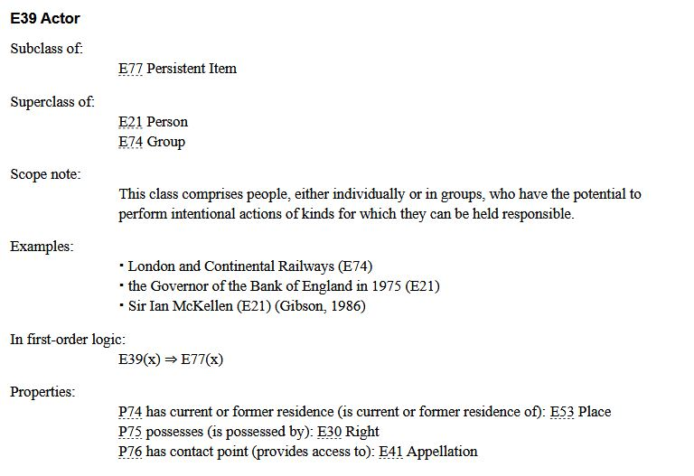

-->

# SODa WissKI Bits: Ontologiegestützte Modellierung von Forschungsdaten

**DATENMODELL ENTWICKELN UND IMPLEMENTIEREN AM BEISPIEL** 

Modul 2: **Modllieren mit CIDCO CRM – verstehen und anwenden**

Einheit 1: **Methoden und Workflows semantischer Modellierung**  

**Dauer:** ~  Min.

**Lernziele:**

Teilnehmende können...

* Methoden zur Entwicklung von Ontologien benennen (LZ-ID 03\_007\_0784)
* Methoden zur Entwicklung von Ontologien erläutern (LZ-ID SODa\_03\_007\_0839)
* Workflow semantischer Modellierung benennen (LZ-ID SODa\_03\_001\_0626)
* Workflow semantischer Modellierung anwenden (LZ-ID SODa\_03\_001\_0627)

---

## (inhalte aktualisieren) 

## Warum verwenden wir Ontologien?

Bei der Modellierung von Forschungsdaten aus den Geistes- und Kulturwissenschaften geht es nicht nur darum, Daten zu beschreiben. 

Es geht darum eine Domäne standardisiert zu dokumentieren und zu beschreiben, verfügbar zu machen und zu teilen und technisch und inhaltlich langfristig nutzbar zu halten.

Ontologien helfen dabei:

* **Semantik der Daten zu erfassen**
* **Semantische Beziehungen auszudrücken**
* **Kontext und Provenienz zu erhalten**
* **Wissen maschinenlesbar zu machen**
* **Interoperabilität zwischen Einrichtungen und Systemen sicherzustellen**
* **Daten mit dem Linked Open Data-Ökosystem zu verbinden**

---

## Was ist CIDOC CRM?

[CIDOC CRM](https://cidoc-crm.org/) ist eine **ISO-zertifizierte Ontologie (ISO 21127)**, entwickelt vom **CIDOC-Komitee der ICOM (International Council of Museums)**.

Es ist **kein technischer Standard**, sondern ein **Papierdokument** und wurde speziell für die **Dokumentation kulturellen Erbes** entwickelt. 

Es ist eine **formale Repräsentation** von grundlegenden Konzepten, Begriffen und ihren Beziehungen im Bereich des kulturellen Erbes.

Es ist ein **theoretisches und praktisches Werkzeug** zum Strukturieren, Darstellen und Verstehen **evidenzbasierter Phänomene** aus dem Bereich des kulturellen Erbes. [1]

CIDOC CRM umfasst:

* Ereignisse  
* Personen  
* Objekte  
* Orte  
* Zeiträume  
* und deren semantische Beziehungen

**Kurz gesagt:**  

CIDOC CRM bietet einen **gemeinsamen konzeptuellen Rahmen**, um kulturelle Informationen **verständlich und interoperabel** zu beschreiben.

WissKI verwendet in der technischen Implementierung die **CIDOC CRM OWL-Ontologie ([Erlangen CRM](https://erlangen-crm.org))** als Grundlage, kann jedoch auch andere Ontologien einbinden.

**OWL (Web Ontology Language)** ist eine **formale Sprache zur maschinenlesbaren Darstellung von Ontologien im Web**, standardisiert durch das World Wide Web Consortium (W3C).

---

## Zentrale Konzepte in CIDOC CRM

| Konzept          | Beispielklasse (Entity)             | Bedeutung                                |
|-------------------|----------------------------|-------------------------------------------|
| Ding              | **E70 Thing**              | Physisches oder immaterielles Objekt      |
| Physisches Objekt | **E22 Human-Made Object**  | Artefakt, Exponat, Sammlungsobjekt        |
| Akteur            | **E21 Person**, **E74 Group** | Individuum oder Organisation           |
| Ereignis          | **E5 Event**               | Eine Handlung oder Veränderung            |
| Ort               | **E53 Place**              | Räumlicher Kontext                         |
| Zeit              | **E52 Time-Span**          | Zeitlicher Rahmen                          |

---

## Klassenhierarchie und Scope Notes

Die **Scope Note** einer CIDOC CRM-Klasse legt fest:

* **Was sie ausdrückt**
* **Welche Bedeutung und Grenzen sie hat**
* **Wann sie verwendet werden sollte**

**Achtung: Nicht entscheidend sind:**

* der Name der Klasse (Entity),
* ihre hierarchische Position,
* oder intuitive Assoziationen.

**Scope Notes sind maßgeblich für die korrekte Modellierung.**

---

## Modellierungsstrategie im Tutorial

Es gibt verschiedene Ansätze, Domänenontologien zu erweitern:

* Neue **Subklassen (Entities)** bilden
* Neue **Eigenschaften (Properties)** definieren
* **Reine Wiederverwendung** bestehender CIDOC CRM-Klassen (Entities) und -Eigenschaften (Properties)
* **Kombinationen** der oben genannten Strategien

In diesem Tutorial wird eine **leichtgewichtige Erweiterungsstrategie** empfohlen:

→ **Domänenspezifische Subklassen (Entities) für die domänenspezifischen Konzepte anlegen**
→ **Eigenschaften (Properties) werden weitestgehend aus CIDOC CRM übernommen**

Das garantiert **Interoperabilität und CIDOC-Kompatibilität**, reduziert die Komplexität und macht dennoch die Domänenspezifik deutlich.

---

## Bedeutung ausdrücken mit CIDOC CRM

CIDOC CRM ist **ereigniszentriert**, d.h. es beschreibt nicht nur, *was etwas ist*, sondern **was mit ihm passiert**.

Die Aussagen über die Ressourcen haben die Form von **Triples: Subjekt-Prädikat-Objekt**. Die Triples bilden die **Syntax-Grundlage** für semantische Datenmodellierung und die technologische Basis, Ontologien (wie CIDOC CRM) in maschinenlesbarer Form darzustellen.

Das **RDF (Resource Description Framework)** ist ein Standard zur Beschreibung von Aussagen über Ressourcen in From von Triples. [2]

**Beispiel: Zelda-Spiel (SNES)**

*Das Videospiel „The Legend of Zelda: A Link to the Past“ wurde 1991 von Nintendo in Kyoto, Japan entwickelt.*

| Natürliche Aussage | CIDOC CRM-Repräsentation |
|--------------------|--------------------------|
| Das Spiel ist ein Objekt | **E22 Human-Made Object** |
| Titel: *The Legend of Zelda: A Link to the Past* | **E22** → *has title* → **E35 Title** |
| Es wurde hergestellt | **E65 Creation** |
| Hersteller ist Nintendo | **E65 Creation** → *carried out by* → **E74 Group (Nintendo)** |
| Produktionsort ist Kyoto | *took place at* → **E53 Place (Kyoto)** |
| Jahr: 1991 | *has time-span* → **E52 Time-Span (1991)** |

---

## Top-Level- vs. Domänenontologien

| Top-Level Ontologie (Grundstruktur) | Domänenontologie (Fachspezifik) |
|------------------------------------|---------------------------------|
| z.B. **CIDOC CRM** | Erweiterungen, WissKI-Flavors etc. |
| definiert grundlegende Konzepte | Beschreibt fachspezifische Konzepte |
| sorgt für Interoperabilität | erhöht Präzision |
| ist langfristig stabil | ist anpassbar an Forschungsbedarfe |

---

## Relevanz und Nutzen von CIDOC CRM 

WissKI nutzt CIDOC CRM, weil es …

* **eindeutige, maschinenlesbare Bedeutungen** schafft
* **Begriffsmehrdeutigkeit und Datenisolierung** vermeidet
* **institutionenübergreifende Interoperabilität** ermöglicht
* **Ereignisse, Prozesse und Provenienz** systematisch abbildet
* **FAIR & Linked Open Data** unterstützt
* **robustes Fundament** für Wissensgraphen bietet 
* sich vollständig in den **WissKI** integrieren lässt.

---

## Bibliographie

[1] CIDOC CRM Special Interest Group (o.J.). What is CIDOC CRM? https://cidoc-crm.org/

[2] World Wide Web Consortium (W3C). (2014). RDF 1.1 concepts and abstract syntax. https://www.w3.org/TR/rdf11-concepts/
