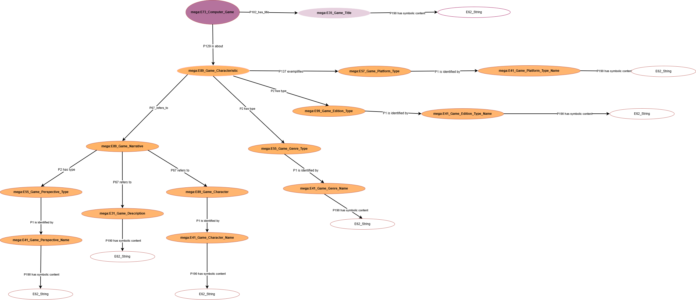

<!--
author: Canan Hastik (0000-0003-1729-4642)

author: Gudrun Schwenk ()

email: c.hastik@igsd-ev.de

email: g.schwenk@igsd-ev.de

version:  v1

language: DE

icon: https://raw.githubusercontent.com/soda-collections-objects-data-literacy/liascript-oers/refs/heads/main/resources/SODa-Logo_full.svg
link: https://raw.githubusercontent.com/soda-collections-objects-data-literacy/SODa_WissKI-ISWC25Bits/refs/heads/main/soda.css

license: CC BY 4.0

comment: Dieser Text erscheint als Info innerhalb der Liascript-Module oben rechts hinter dem (i) und sollte den Inhalt des Moduls kurz beschreiben. Vorschlag: Mirco-Content zum Lernziel "Lernende können FAIR-Prinzipien erläutern". Dieses Modul ist Teil eines Einführungskurses zum Forschungsdatenmanagement, der von “OER.Net UAG FDM-Basiskurs” auf Grundlage der Lernzielmatrix zum FDM entwickelt wurde. Der Basiskurs entwickelt das Konzept der EduBricks weiter und ist als “Arbeitsgruppe 3: Einbettung und Vernetzung des modularen und skalierbaren Konzeptes” zudem Teil der NFDI-Sektion Education and Training.

title: Template für die Erarbeitung eines Micro-Contents anhand eines Lernziels für generischen FDM-Basiskurs

description: Dieses Template wurde als Vorlage für die Entwicklung von Microlearning-Content zum Themenbereich Forschungsdatenmanagement (FDM) in Orientierung an Lernzielen der [Lernzielmatrix zum Forschungsdatenmanagement (FDM)](https://zenodo.org/records/15025246) entwickelt.

keywords: FDM, Forschungsdatenmanagement, Forschungsdaten, Lernziel, Micro-Content

community: Wissenschaftliche Kommunikationsinfrastruktur (WissKI) und Sammlungen, Objekte, Datenkompetenzen (SODa)

PublicationDate: noch unveröffentlicht

LearningResourceType: SODa How-to-Tutorial

-->

# SODa WissKI Bits: Ontologiegestützte Modellierung von Forschungsdaten

**DATENMODELL ENTWICKELN UND IMPLEMENTIEREN AM BEISPIEL** 

Modul 2: **Vom Diagramm zu Pfaden – Erläutern und anwenden**

Einheit 2: **Visualisierung der Domänenontologie in Draw.io**  

**Dauer:** ~ 25 Min.

Lernziel

* Kernentitäten (Objekt/Person/Ort/Zeit/Ereignis) einer Objektsammlung anwenden. (LZ-ID SODa\_03\_007\_0811)
* Software zur Visualisierung einer Domänenontologie benennen und erläutern.(LZ-ID SODa\_03\_007\_0812 und LZ-ID SODa\_03\_007\_0813)
* Nutzen einer Software zur Visualisierung einer Domänenontologie benennen.(LZ-ID SODa\_03\_007\_0814) 
* Software zur Visualisierung einer Domänenontologie unter Anleitung anwenden. (LZ-ID SODa\_03\_007\_0815)
* Regeln zur Modellierung einer Domänenontologie mit einer Visualisierungssoftware benennen. (LZ-ID SODa\_03\_007\_0820)
* Regeln zur Modellierung einer Domänenontologie mit einer Visualisierungssoftware anwenden. (LZ-ID SODa\_007\_0816)
* Attributwerte an vordefinierten Klassen der Domänenontologie in einer Visualisierungssoftware anwenden. (LZ-ID SODa\_03\_007\_0817)

---

## Visualisierung mit Draw.io

In dieser Einheit wird das in Modul 1 entwickelte Datenmodell als Diagramm in Draw.io visualisiert. 

Das entwickelte Draw.io-Diagramm bildet die **Voraussetzung für die (halb-)automatisierte Pipeline** zur Erstellung eines **WissKI Pathbuilders**.

**Visualisierungen** sind bildliche Darstellungen von Sachverhalten, die deren Verständnis befördern sollen. 

"In den Geisteswissenschaften werden Visualisierungen als Illustrationen, als Gedächtnisstützen für bekannte Sachverhalte, bei der Organisation von Wissen, sowie als Erkenntnismittel in der Vermittlung und Erzeugung von (neuem) Wissen eingesetzt." [1]

"Zum Lernen sind Visualisierungen insbesondere dann geeignet, wenn der zu vermittelnde Gegenstand verbal nur schwer vermittelbare Eigenschaften aufweist." [2] 

Sie werden daher begleitend zum  Wissenserwerb eingesetzt, um Inhalte konkreter und besser verständlich zu machen und Strukturen zu verdeutlichen. [3]

Das Visualisieren in Draw.io ist somit nicht nur eine **visuelle Übung**, sondern gleichzeitig ein **expliziter Modellierungsschritt**, um **Modellierungsentscheidungen zu kommunizieren, auszuhandeln und ein gemeinsames Verständnis über semantische Strukturen zu treffen und zu fördern.**

---

## Nutzen von Draw.io 

Draw.io wird eingesetzt um...

* **Klassen (Entities) und ihre Beziehungen (Properties)** klar zu definieren,
* eine **Domänenlogik mit ihren semantischen Zusammenhängen** sichtbar und diskutierbar zu machen,  
* Domänenmodelle **kollaborativ und transparent** zu entwickeln,  
* eine **Domänenontologie vor dem Import in WissKI** zu prüfen,  
* **semantische Modellierungsentscheidungen** zu reflektieren und abzusichern.

Besonders in kollaborativen Projekten erleichtert Draw.io die **Abstimmung zwischen Fachexpert:innen, Datenmodellierenden und Entwickler:innen**, da semantische Entscheidungen visuell nachvollziehbar und dokumentierbar sind und bleiben.

----

## Ausgangspunkt

Damit diese Visualisierung korrekt umgesetzt werden kann, müssen die relevanten Elemente der Domäne noch einmal klar sein.

In Modul 1 wurde die konzeptionelle Grundlage des Beispiel-Datenmodells entwickelt:

* In **Einheit 5** wurden *zentralen Konzepte (Entities)* eines Beispielobjektes aus der Computerspiel-Domäne identifiziert. 
* In **Einheit 6** wurde gezeigt, wie die Top-Level Ontologie CIDOC CRM um *domänenspezifische Subklassen* erweitert wird.  

**Zur Orientierung und zum Nachlesen**

* [Beispielobjekt](https://github.com/soda-collections-objects-data-literacy/SODaHow-to-Tutorial/blob/main/WissKIBits_Modul1/M1E2_Analyse-Workflow.md#beispielobjekt)
* [Beispiele für zentrale Konzepte (Spielmerkmale und narrative Elemente)](https://github.com/soda-collections-objects-data-literacy/SODaHow-to-Tutorial/blob/main/WissKIBits_Modul1/M1E5_Dom%C3%A4nenanalyse.md#fokus-dieser-modellierungs%C3%BCbung)

---

## Quizfragen

Bevor das Domänenmodell nun in Draw.io umgesetzt wird, soll noch einmal überprüft werden, welche zentralen Konzepte für das Beispielobjekt im Kontext von Spielemerkmalen und narrativen Elemeten relevant sind.

Die folgenden Fragen dienen dazu, die zentralen Konzepte der Domäne noch einmal zu aktivieren und helfen die anschließende Modellierungsaufgabe besser einzuordnen.

### Welches Beispielobjekt wird im Modul verwendet? 

* [( )] Ein PC-Spiel: *Minecraft*
* [(x)] Ein SNES-Spiel: *The Legend of Zelda*
* [( )] Eine PlayStation-Konsole: *PS1*
* [( )] Ein Arcade-Automat: *Pac-Man*

### Welche semantische Annahme wird im Beispiel explizit gemacht?

* [( )] Das Spiel ist „Open World“
* [(x)] Der Titel des Objekts wird als *The Legend of Zelda: A Link to the Past* festgelegt
* [( )] Das Spiel ist eine „Collector’s Edition“
* [( )] Die Plattform ist „PC“

### Welche der folgenden Konzepte zählen zu den **Spielmerkmalen**?

* [[ ]] Perspektive
* [[X]] Genre
* [[X]] Edition
* [[X]] Plattform
* [[ ]] Hersteller

### Welche der folgenden Konzepte zählen zu den **narrativen Elementen**?

* [[X]] Perspektive
* [[X]] Spielbeschreibung
* [[X]] Charaktere
* [[ ]] Plattform
* [[ ]] Genre

---

## Von den Konzepten zur strukturierten Visualisierung

Die bisherigen Fragen haben verdeutlicht, welche zentralen Konzepte der Beispieldomäne relevant sind und wie sie fachlich eingeordnet werden können.

Im nächsten Schritt geht es nicht mehr um das Erkennen oder Benennen dieser zentralen Konzepte, sondern darum, diese Auswahl in eine **formalisierte Pfadstruktur** zu überführen:

* Wie werden die zentralen Konzepte semantisch korrekt miteinander verknüpft?
* Wie entsteht daraus eine formalisierte Pfadstruktur, die in Form von **Pfaden und Pfadgruppen im WissKI Pathbuilder** nutzbar ist?

Dazu wird das konzeptionelle Domänenmodell nun **visuell und formal in Draw.io** umgesetzt.  

---

### Regeln zur Visualisierung mit Draw.io 

* Die Knoten und Kanten müssen korrekt verbunden sein.
* Die Kantenbeschriftung muss mit der Kante verbunden sein.
* Die Benennungen können, müssen aber nicht Unterstriche beinhalten.
* Es werden keine individuellen Instanzen abgebildet.
* Es werden die domänenspezifischen Subklassen aus der bereits erstellten Domänenontologie verwendet.
* Die Beziehungen aus dem CIDOC CRM werden nachgenutzt.
* Es sind vollständige Pfade zu erstellen. (z.B. mega:E73\_Computer\_Game -> P102\_has\_title -> mega:E35\_Game\_Title -> P190 has symbolic content -> E62\_String)
* Dem zentralen Startknoten, jedem Gruppenknoten und jedem Endknoten werden jeweils **element\_id**, **group\_name** und **name** zugewiesen. (z.B. element\_id=Computer\_Game; group\_name=Computer\_Game; name=Computer\_Game)

### Aufgabe (Einzelarbeit – 20 Min.)

Die Aufteilung in Breakout-Räume findet zufällig statt.

Das bereitgestellte Diagramm enthält gezielt Lücken (fehlende Knoten/Kanten), die zu ergänzen sind. 

Diese Lücken sind durch geeignete Klassen (Entities) und passende Beziehungen (Properties) zu schließen.

Die temporären Platzhalter (???) sind nach der Ergänzung zu entfernen.

**Ablauf**

* Die vorbereitete Draw.io-Datei runterladen ([hier](../assets/M2E2_Gruppenarbeit.drawio.xml))
* Die heruntergeladene Draw.io-Datei in Draw.io importieren ([hier](https://app.diagrams.net/))
* Das Domänenontologie-Diagramm vervollständigen (siehe Auswahl) 
* Attributwerte an Startknoten, jedem Gruppenknoten und Endknoten prüfen
* Die Knoten-Kanten-Verbindungen prüfen

**Auswahl**

* P102\_has\_title
* P1 is identified by
* P190 has symbolic content
* mega:E41\_Game\_Character\_Name
  
**Ressourcen**

* Domänenontologie: [http://games.m-e-g-a.org/game_domain.rdf](http://games.m-e-g-a.org/game_domain.rdf)
* Für semantische Beziehungen (.pdf-Datei): [https://cidoc-crm.org/sites/default/files/cidoc_crm_version_7.1.3.pdf](https://cidoc-crm.org/sites/default/files/cidoc_crm_version_7.1.3.pdf)
* Alternative zur PDF-Datei ein HTML-Darstellung: [https://cidoc-crm.org/html/cidoc_crm_v7.1.3.html](https://cidoc-crm.org/html/cidoc_crm_v7.1.3.html)

### Beispielergebnis

<table>
  <tr>
    <td></td>
  </tr>
</table>

## Ausblick

Im nächsten Schritt wird das erstellte Draw.io-Diagramm automatisch in einen WissKI Pathbuilder konvertiert und die erzeugte Pfadstruktur in WissKI importiert.

---

## Bibliographie

[1] https://zfdg.de/wp_2023_014
[2] https://dorsch.hogrefe.com/stichwort/visualisierung
[3] Levin et al., 1987

